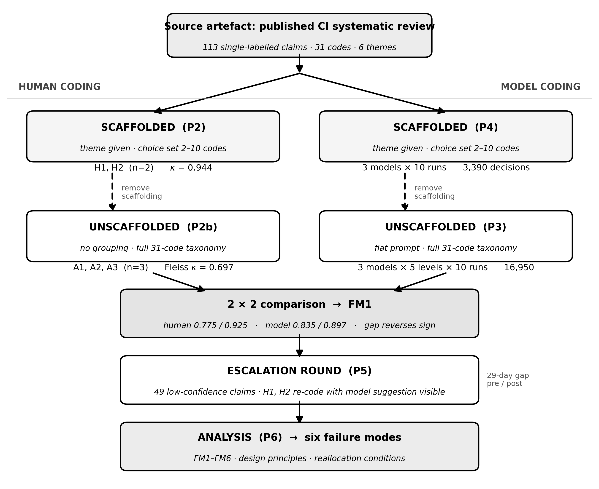

<div align="center">

# Who Decides, and on What Evidence?

### Replication package for *A Failure Taxonomy for Human–AI Authority Allocation in Software Engineering Evidence Synthesis*

[](LICENSE)
[](https://creativecommons.org/licenses/by/4.0/)
[](requirements.txt)
[](results/tables/verification_report.csv)

</div>

---

Human-in-the-loop arrangements for delegating interpretive work to language
models rest on evidence: a comparison showing which party is more accurate,
an uncertainty signal showing where supervision is needed, and the
assumption that an escalated decision is resolved by the human who receives
it. This package contains every input, instrument, and output behind the
paper's examination of that evidence, and a single script that recomputes
110 of the paper's reported quantities and checks each one against the
value printed in the paper.

> **Reproduce the paper in under a minute, with no API access:**
> ```bash
> pip install -r requirements.txt
> python scripts/06_reproduce_paper.py
> ```
> Expected final line: `110 checks, 110 PASS, 0 FAIL`. Runtime: about 6 s on
> a laptop.

---

## Contents

1. [The study at a glance](#1-the-study-at-a-glance)
2. [From the paper to the artefact](#2-from-the-paper-to-the-artefact)
3. [Getting started](#3-getting-started)
4. [Repository structure](#4-repository-structure)
5. [Data dictionary](#5-data-dictionary)
6. [Re-running data collection](#6-re-running-data-collection)
7. [Scoring conventions](#7-scoring-conventions)
8. [Provenance, licences, and corrections](#8-provenance-licences-and-corrections)
9. [Scope and known limitations of the artefact](#9-scope-and-known-limitations-of-the-artefact)
10. [Citation](#10-citation)

---

## 1. The study at a glance

| Component | What it contains |
|---|---|
| **Corpus** | 113 single-labelled evidence claims from a published systematic literature review on continuous integration, drawn from 36 primary studies and coded against 31 codes in 6 themes |
| **Human coding** | Five annotators. **Scaffolded** (H1, H2): claims grouped under their reference theme, so the choice set is the 2–10 codes of one theme. **Unscaffolded** (A1–A3): a flat, independently randomised list against all 31 codes |
| **Model coding** | Claude Haiku 4.5, DeepSeek Chat, GPT-4o Mini. **Unscaffolded**: five context levels (L1–L5) × ten runs. **Scaffolded**: L1 × ten runs, with the codebook restricted to the claim's reference theme and the prompt otherwise byte-identical |
| **Escalation round** | The 49 claims below a 0.8 confidence threshold, re-coded by H1 and H2 with the model's proposal visible, 29 days after their blind round |
| **Decisions** | 21,003: 16,950 unscaffolded and 3,390 scaffolded model decisions, 565 blind human decisions, 98 escalation decisions. The analytical unit is the claim (*n* = 113); repeated runs are stability probes, not independent observations |

<p align="center"></p>

## 2. From the paper to the artefact

The script `scripts/06_reproduce_paper.py` recomputes 110 quantities reported
in the paper's tables and in Sections 3.1–4.6, and lists each one, with its
location in the paper, in
[`results/tables/verification_report.csv`](results/tables/verification_report.csv).

### Research questions

| RQ | Failure mode(s) | Evidence in this package |
|---|---|---|
| **RQ1** Does the human–model comparison depend on the instruments? | FM1 Scaffolding Asymmetry, FM2 Instrument-Induced Failure | `data/human/blind/`, `data/model/`, `data/instruments/`, `prompts/` |
| **RQ2** Do coders converge on the reference standard? | FM3 Reference-Standard Illusion | `data/reference/`, `data/human/blind/`, `data/model/scaffolded/` |
| **RQ3** Do uncertainty signals identify decisions needing supervision? | FM4 False Consensus | `data/model/unscaffolded/` (confidence and repeated runs) |
| **RQ4** How do humans perform on what escalation routes to them? | FM5 Escalation Illusion | `data/human/blind/scaffolded_H*.csv`, `data/model/unscaffolded/claude-haiku-4-5/L1/` |
| **RQ5** How does exposure to the proposal change the reviewer's judgement? | FM6 Automation-Induced Anchoring | `data/human/escalation/`, `data/instruments/sheet_escalation_*_as_sent.csv` |

### Tables

| Table in the paper | Output file |
|---|---|
| Decision-space effects: accuracy and agreement (`tab:scaffolding`) | [`decision_space_accuracy_agreement.csv`](results/tables/decision_space_accuracy_agreement.csv) |
| Instrument-induced effects by model (`tab:instrument`) | [`instrument_effects.csv`](results/tables/instrument_effects.csv) |
| Confidence bands at L1 (`tab:consensus`) | [`confidence_bands_L1.csv`](results/tables/confidence_bands_L1.csv) |
| Composition of escalated and retained sets (`tab:escalation`) | [`escalation_composition.csv`](results/tables/escalation_composition.csv) |
| Claims resisting all scaffolded models (FM3) | [`resistant_claims.csv`](results/tables/resistant_claims.csv) |
| Escalation-round revisions (FM6) | [`escalation_revisions.csv`](results/tables/escalation_revisions.csv) |
| Accuracy by context level, L1–L5 | [`accuracy_by_context_level.csv`](results/tables/accuracy_by_context_level.csv) |

The two remaining tables in the paper, the positioning table and the
normative summary of the taxonomy, are conceptual and contain only
quantities that are verified individually in the report.

## 3. Getting started

**Requirements.** Python 3.12 (tested with numpy 2.4 and scikit-learn 1.8);
no GPU; under 30 MB of disk. Re-running the models additionally requires API
keys for the three providers.

```bash
git clone <this repository>
cd human-ai-authority-allocation
pip install -r requirements.txt
python scripts/06_reproduce_paper.py
```

The script reads only `data/`, writes the tables to `results/tables/`, and
exits with status 0 when every check passes. Pass `--literal` to score model
output as written rather than normalised (Section 7).

## 4. Repository structure

```
human-ai-authority-allocation/
├── README.md                      this guide
├── LICENSE                        MIT, with the CC BY 4.0 notice for source material
├── CITATION.cff                   how to cite this package and the source review
├── requirements.txt
├── data/
│   ├── README.md                  provenance, contents, and corrections
│   ├── reference/                 claims, reference labels, codebook
│   ├── instruments/               everything given to the annotators
│   ├── human/
│   │   ├── blind/                 five blind coding sheets
│   │   └── escalation/            two escalation sheets as returned
│   └── model/
│       ├── unscaffolded/          <model>/<level>/*.json   16,950 decisions
│       └── scaffolded/            <model>_L1.csv           3,390 decisions
├── prompts/
│   ├── unscaffolded/              prompt_L1.txt … prompt_L5.txt
│   └── scaffolded/                one complete scaffolded prompt
├── scripts/
│   ├── 01_build_prompts.py        regenerates the five prompts, byte-identical
│   ├── 02_run_unscaffolded_claude.py
│   ├── 03_run_unscaffolded_deepseek.py
│   ├── 04_run_unscaffolded_openai.py
│   ├── 05_run_scaffolded.py
│   └── 06_reproduce_paper.py      recomputes and verifies the paper's figures
├── notebooks/
│   ├── run_unscaffolded.ipynb     steps 1–4 and 6, locally or in Colab
│   └── run_scaffolded.ipynb       steps 5 and 6
└── results/
    ├── tables/                    written by 06_reproduce_paper.py
    └── figures/study_design.png
```

## 5. Data dictionary

**`data/reference/ci_claims_reference.json`** — one record per claim.

| Field | Meaning |
|---|---|
| `paper_id` | Claim identifier (`C891` … `C1015`) |
| `input.claim` | Claim text, verbatim from the source review |
| `input.study_title`, `input.kind`, `input.variables` | Study context used at levels L2–L5 |
| `labels.code`, `labels.theme` | Reference code and theme |

**`data/model/unscaffolded/<model>/<level>/*.json`** — one file per run, 113 records each.

| Field | Meaning |
|---|---|
| `prediction.code`, `prediction.theme` | Code and theme as returned, before normalisation |
| `prediction.confidence` | Self-reported confidence, 0–1 |
| `meta.raw_response` | Full model response |
| `meta.parse_success`, `meta.timestamp`, token counts | Run metadata |

**`data/model/scaffolded/<model>_L1.csv`** — one row per decision: `claim_id`,
`model`, `model_id`, `level`, `run`, `predicted_code` (before normalisation),
`predicted_theme`, `confidence`, `choice_set_size`.

**`data/human/blind/*.csv`** — the annotation sheets as returned. Columns:
row number, claim identifier, claim text, the annotator's code, and an
optional remark. The scaffolded sheets also contain the theme header rows
that produced the scaffolding.

## 6. Re-running data collection

Re-running the models is not needed to reproduce the paper and incurs
provider costs. Set the keys as environment variables; no script reads keys
from files in the repository.

```bash
export ANTHROPIC_API_KEY=PUT_YOUR_API_KEY_HERE
export DEEPSEEK_API_KEY=PUT_YOUR_API_KEY_HERE
export OPENAI_API_KEY=PUT_YOUR_API_KEY_HERE

python scripts/01_build_prompts.py                          # prompts/unscaffolded/
for i in $(seq 1 10); do
  python scripts/02_run_unscaffolded_claude.py   --run_id $i
  python scripts/03_run_unscaffolded_deepseek.py --run_id $i
  python scripts/04_run_unscaffolded_openai.py   --run_id $i
done
python scripts/05_run_scaffolded.py --model claude --level L1 --dry-run   # inspect the prompt first
python scripts/05_run_scaffolded.py --model claude   --level L1 --runs 10
python scripts/05_run_scaffolded.py --model deepseek --level L1 --runs 10
python scripts/05_run_scaffolded.py --model openai   --level L1 --runs 10
```

| Model | Identifier | Version-locked |
|---|---|---|
| Claude Haiku 4.5 | `claude-haiku-4-5-20251001` | yes |
| GPT-4o Mini | `gpt-4o-mini-2024-07-18` | yes |
| DeepSeek Chat | `deepseek-chat` | no |

All calls use `temperature = 0.0` and `max_tokens = 512`. Greedy decoding is
not fully deterministic, so a re-run will not reproduce every decision; the
released outputs are those analysed in the paper.

## 7. Scoring conventions

These follow Section 3.5 of the paper and are applied at analysis time; no
data file is altered by them.

* **Model output.** Code strings are validated against the 31-code taxonomy;
  strings absent from it are mapped to the nearest canonical label (Python
  `difflib`, cutoff 0.6). The string `NO MATCHING CODE` is treated as an
  abstention and scored as incorrect.
* **Human output.** Codes are compared after upper-casing and collapsing
  whitespace; a stray double quote is read as a space. An entry of `?` is an
  abstention and is excluded from that annotator's denominator.
* **Arithmetic.** Differences between accuracies are computed from unrounded
  values; reported values are rounded only for display.

## 8. Provenance, licences, and corrections

The claims, codes, definitions, and reference labels come from the artefact
of Soares et al. (2022), released under CC BY 4.0, and are redistributed here
under that licence with attribution. None of the authors of this package took
part in the source review. The study's own data and code are released under
the MIT licence.

The returned annotation sheets are released as returned, with four
documented corrections that change no code, decision, or annotator text. They
are listed in [`data/README.md`](data/README.md), and the sheets as sent are
included alongside the returned ones so that each correction can be checked.

## 9. Scope and known limitations of the artefact

* **What the script verifies.** 110 quantities computed from the study's own
  data, from the corpus statistics of Section 3.1 to the escalation round of
  Section 4.6, each listed in the verification report. The screening statistics of the source review
  (search records, screening agreement) come from the source artefact on
  Zenodo and are not recomputed here.
* **Raw responses.** Full raw responses are retained for the unscaffolded
  condition only; the scaffolded files hold the predicted code string before
  normalisation.
* **Model availability.** The DeepSeek endpoint is not version-locked, and
  hosted models may be retired; the released outputs remain the reference.
* **Sample.** One task, one taxonomy, five annotators, three models. The
  paper reports counts rather than inferential tests, and the package is
  designed to let readers re-derive each count, not to support claims of
  generality.

## 10. Citation

If you use this package, please cite the article and the source review whose
artefact it reuses. Machine-readable metadata is in
[`CITATION.cff`](CITATION.cff).

```bibtex
@article{soares2022ci,
  author  = {Soares, Eliezio and Sizilio, Gustavo and Santos, Jadson and
             da Costa, Daniel Alencar and Kulesza, Uir{\'a}},
  title   = {The Effects of Continuous Integration on Software Development:
             A Systematic Literature Review},
  journal = {Empirical Software Engineering},
  volume  = {27}, pages = {78}, year = {2022},
  doi     = {10.1007/s10664-021-10114-1}
}

@misc{soares2021zenodo,
  author    = {Soares, Eliezio and Sizilio, Gustavo and Santos, Jadson and
               Alencar, Daniel and Kulesza, Uir{\'a}},
  title     = {{SLR} Artifacts -- {CONTINUOUS INTEGRATION QUALITY IMPACTS}},
  version   = {v.1.0.2},
  publisher = {Zenodo}, year = {2021},
  doi       = {10.5281/zenodo.4545623}
}
```

---

<sub>Code: MIT. Material derived from the source review: CC BY 4.0. See
[`LICENSE`](LICENSE).</sub>
